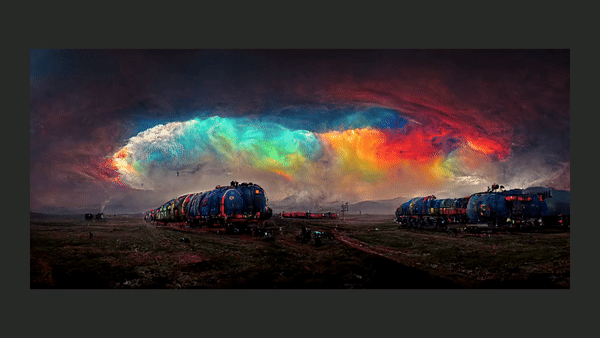

# ***img**


<p align="center">
  
</p>


*img*: Lightweight image viewer for *nix systems.

[](https://packagist.org/packages/aimeos/aimeos-typo3)

'**img**' is a lightweight CLI image viewer written in C++ using SDL2 as the graphics API. 'img' is designed around being a lightweight image viewer while simultaneously helping to further my understanding of graphics programming and rendering pipelines.


If '**img**' is executed without a specific target it will peruse the directory it is executed in to find drawable file formats (image files.) 'img' does so by checking a file's signature bytes.


**Build instructions**
---


1.) To build **cyclic**
```bash
#Create build directory
mkdir img
#Clone the repository
git clone https://www.github.com/algebraictype/img
#Build the image viewer
sudo make
```

**Usage**
---

```
Usage: ./img [OPTIONS]

  img ~ Lightweight image viewer for *nix systems.
  Developed by *(d) -> (Github: algebraictype)


Options:
  your_image.png/your_image.jpg | Display a specific image file.
```
